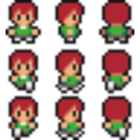

# Story
Enjoying peaceful forest land on your property in the countryside, suddenly,  there are many bats guided by a demon ready to eat you. Your objective is to remain alive by fighting these horror creatures and fortunately, you have equipped gun ready to shoot

# Gameplay

## Player

The player will be controlled using a mouse and a keyboard. He will be moving around the map in all directions.
To move the player:

- PRESS "W" : To move UP
- PRESS "S" : To move DOWN
- PRESS "D" : To move RIGHT
- PRESS "A" : To move LEFT
 To shoot at the bat :
- Point the mouse at the direction of the bats
- PRESS "LEFT MOUSE KEY" to shoot

## Bats

Here below an image of the type of bats that will attack the player. The bats will follow the player where ever he goes on the map and won't rest until they kill and eat him.

## Score

Every bat killed in the game will increase the score by 1.

## Game Over

The game will end when a bat touches the player. The score reached by the player will be shown and saved into an external API.

# Developer's Notes

This project was developed in these stages:

- Stage 1: Learning how to use Phaser 3, following tutorials and how to setup a game's structure built with Javascript (2 days).
- Stage 2: Creating the GDD (0.5 day).
- Stage 3: Creating the project's codes organizational structure (0.5 day).
- Stage 4: Creating the project's scenes (2 day)
- Stage 5: Creating functions to save the player's score and get top scores (0.5 day).
- Stage 6: Adding sound effects and testing functions using Jest (0.5 day).
- Stage 7: Testing the gameplay, fixing bugs and deployment (1 day).

# Making Of

This project was built using [Phaser 3](https://phaser.io/phaser3), [Webpack](https://webpack.js.org/) and Javascript.

# Acknowledgements

- This project is the Javascript Capstone project and is part of [Microverse](https://www.microverse.org/) curriculum, which am proud to be part of. At Microverse, I learned how to code and build amazing projects. Also, Microverse provided me with an [API](https://us-central1-js-capstone-backend.cloudfunctions.net/api/) to save the player's scores.

- Thanks to [OpenGameArt](https://opengameart.org/) for providing the free assets I used in this game.

- Thanks to [Altegore](https://www.deviantart.com/Adviel) from DevianArt the amazing map I used in this game!
 

- Thanks to [Unsplash](https://unsplash.com/) for the image I used as logo

- Thanks to [zapsplat](www.zapsplat.com) and [OpenGameArt](https://opengameart.org/) for all the sounds played on this game