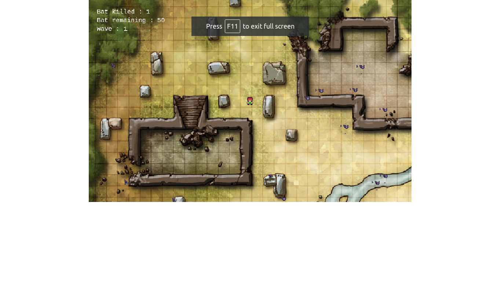
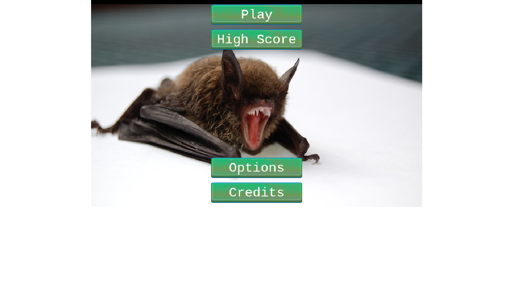
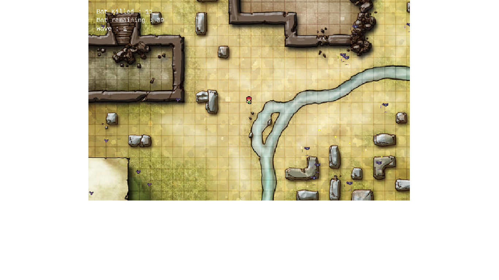
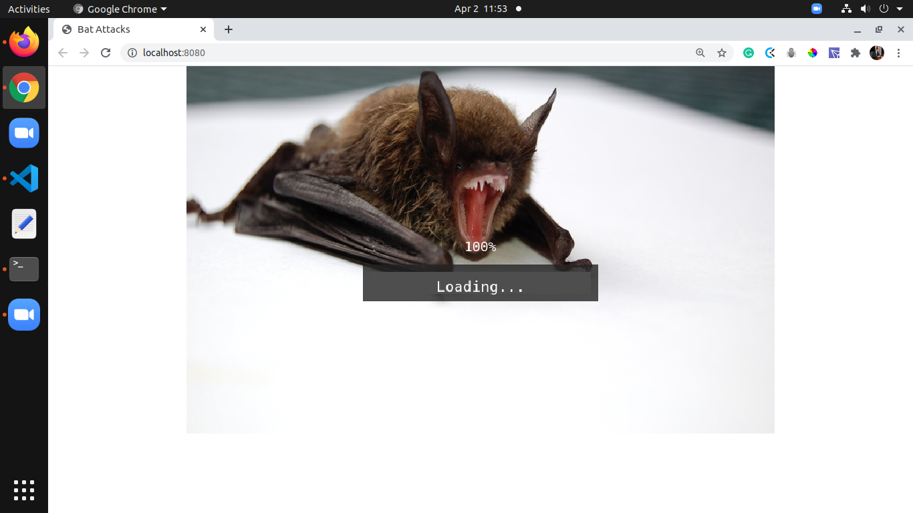

# Bat Attacks Game

> Bat Attakcs is a simple RPG Game that relate the story of a person that was attacked by
many bats guided by demons. Please read the [Game Design Document](#game-design-document) for further information about the story and the gameplay.

## Game Design Document

[Game Design Document](./GAME_DESIGN_DOCUMENT.md)

## Instructions on how to play the game

You can control the player using a mouse and a keyboard. You can move around the map in all directions, holding a machine gun and shooting at the bats.

To move the player:

- PRESS "W" : To move UP
- PRESS "S" : To move DOWN
- PRESS "D" : To move RIGHT
- PRESS "Q" : To move LEFT

  To shoot at the bat :

- Point the mouse at the direction of the bat
- PRESS "MOUSE LEFT KEY" to shoot

## Screenshots

## Live Demo

[Live Demo Link](https://sharp-blackwell-6ed620.netlify.app)

## Built With

- Javascript
- Phaser 3 Game Framework
- Tiled Map Editor
- HTML
- CSS

## Setup ⏳

> Follow these steps to setup this web application locally :

- Open your `Terminal`.
- Navigate to the directory where you will like to install the repo by running `cd FOLDER-NAME`
- Download using `HTTPS` by running `git clone https://github.com/tahiry-dev/batAttacks.git` in the terminal.
- Run `cd batAttacks` to enter directory.
- Run `npm install` to install node packages and dependencies.
- Run `npm run start` in your browser to start the application.

## Testing ⚙️

> I have used [Jest](https://jestjs.io/) testing tool to test functions by creating several test cases. Please follow below steps to run Jest testing tool:

 - Open `Terminal` again
 - Run `cd batAttacks` to enter directory
 - Run `npm run test` to start testing

## Authors

👤 **Tahiry RANDRIAMIARINTSOA**

- GitHub: [@tahiry-dev](https://github.com/tahiry-dev)
- Twitter: [@tahiry](https://twitter.com/Tahiry94825074)
- LinkedIn: [RANDRIAMIARINTSOA](https://www.linkedin.com/in/tahiry-randriamiarintsoa/)

## Show your support

Give a ⭐️ if you like this project!

## 📝 License

This project is [MIT](lic.url) licensed.
